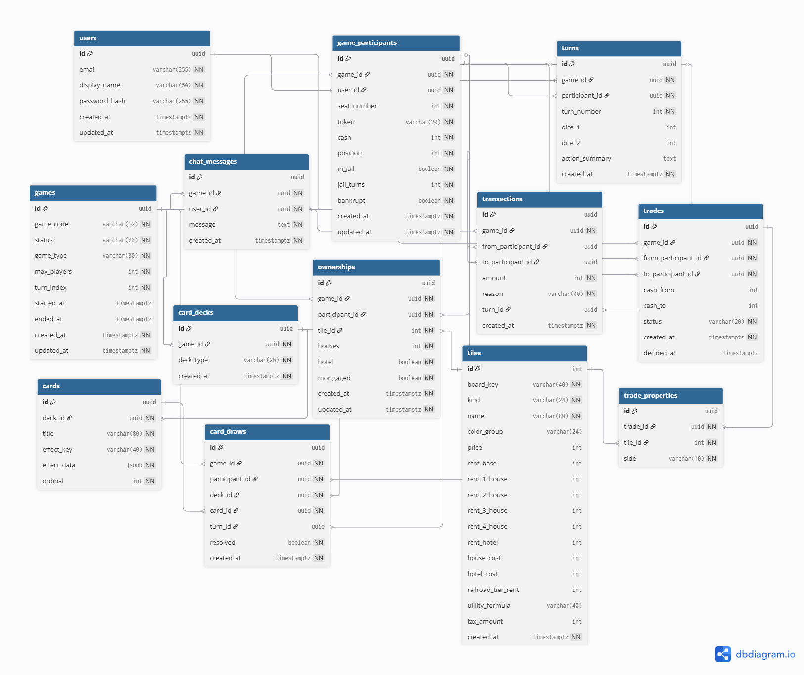

# CSC 667 – Milestone 2: Database Schema (Webopoly)

## Overview
Our **Webopoly** database schema defines how game data, users, and real-time gameplay are stored in PostgreSQL.  
It supports all the features outlined in **Milestone 1**, including multiplayer rooms, property ownership, dice rolls, chance cards, and in-game transactions.

---

## Core Tables

| Table | Description |
|--------|--------------|
| **users** | Stores account information for login, profiles, and display names. |
| **games** | Represents each game session with its type, status, and timestamps. |
| **game_participants** | Join table linking users to games; stores cash, token, position, and turn info. |
| **turns** | Logs each dice roll and resulting actions. |
| **tiles** | Stores all board spaces (properties, chance, jail, etc.) for different board variants. |
| **ownerships** | Tracks who owns which property, including houses, hotels, and mortgage status. |
| **transactions** | Records all financial activity (rent, purchases, taxes, pass GO). |
| **card_decks / cards / card_draws** | Represent Chance & Community Chest decks, card definitions, and drawn results. |
| **chat_messages** | Stores in-game player chat messages. |
| **trades / trade_properties** | Handles property and cash trades between players. |

---

## Relationships

- `users` 1–* `game_participants`
- `games` 1–* `game_participants`
- `games` 1–* `turns`
- `turns` 1–* `transactions`
- `games` 1–* `ownerships`
- `tiles` 1–* `ownerships`
- `games` 1–* `card_decks` → `cards` → `card_draws`
- `games` 1–* `chat_messages`
- `games` 1–* `trades` → `trade_properties`

---

## Feature Mapping

| Feature | Supported By |
|----------|---------------|
| **User Authentication / Profiles** | `users` |
| **Create / Join Game Rooms** | `games`, `game_participants` |
| **Player Wallets & Balances** | `game_participants`, `transactions` |
| **Dice Roll & Turn Logic** | `turns` |
| **Property Ownership / Rent / Upgrades** | `tiles`, `ownerships`, `transactions` |
| **Chance & Community Chest Cards** | `card_decks`, `cards`, `card_draws` |
| **Trades Between Players** | `trades`, `trade_properties` |
| **Chat & Communication** | `chat_messages` |
| **Leaderboard & Match History** | `games`, `game_participants` |
| **Real-Time Updates (Socket.io)** | Back-end event layer using schema changes |

---

## Normalization & Rationale

1. **3NF structure:** Each major entity (Users, Games, Turns, Transactions, Cards) has its own table to avoid redundancy.  
2. **Scalability:** Board data (`tiles`) and decks are data-driven, allowing easy expansion for custom rule sets.  
3. **Extensibility:** Future analytics, leaderboards, and replay systems can be added using existing foreign keys and relationships.

---

## Tech Stack

| Layer | Technology | Schema Integration |
|--------|-------------|--------------------|
| **Backend** | Node.js + Express.js | RESTful routes map directly to tables |
| **Database** | PostgreSQL | UUID primary keys, foreign key constraints |
| **Realtime** | Socket.io | Syncs state changes (turns, chat, transactions) |
| **Deployment** | Render | Persistent data via Postgres service |

---

 **Summary:**  
This schema fully supports the gameplay flow, data persistence, and multiplayer logic described in Milestone 1. It’s normalized, scalable, and ready for backend API integration and Socket.io real-time functionality.

